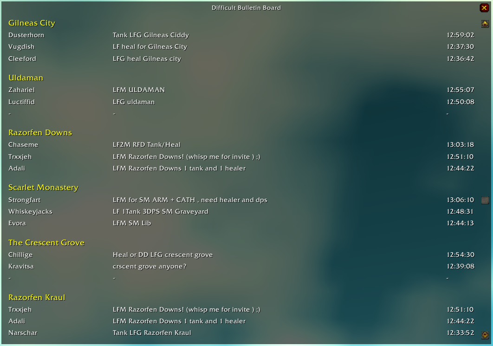

# Difficult Bulletin Board - Addon for Turtle WoW

**Difficult Bulletin Board** is a World of Warcraft 1.12 addon inspired by the LFG Group Bulletin Board that reads the world chat and presents it as an ordered list in an easy-to-read UI. This addon aims to make it easier to find groups for the content you want to do.



## Installation

1. Download the addon by clicking the link below:
   - [Download Difficult Bulletin Board](https://github.com/DeterminedPanda/DifficultBulletinBoard/archive/refs/heads/master.zip)

2. Unzip the `DifficultBulletinBoard-master.zip` archive.

3. Rename the directory inside the zip from `DifficultBulletinBoard-master` to `DifficultBulletinBoard`.

4. Move the `DifficultBulletinBoard` folder to your World of Warcraft AddOns directory:
   - Example path: `C:\World of Warcraft Turtle\Interface\AddOns`

5. If you have WoW open, make sure to restart the game for the addon to load properly.

6. To verify the installation, type `/dbb` in the game chat. If the installation was successful, the addon will open.


## Usage

### Accessing the Bulletin Board

You can open the bulletin board interface by left-clicking on the DifficultBulletinBoard Minimap icon or by typing ```/dbb``` into your chat window.
The interface will show an ordered list of messages from the world chat.

### Editing and Managing Entries

To manage topics, right-click the minimap icon to open the options window and select which topics to follow by selecting or unselecting the corresponding checkbox.

## To-Do List:

- Ensure that when a person already in the list sends a new message, their old entry is removed and they are moved to the top of the list.
- Add support for multiple channels.
- Expand options (e.g., placeholder number adjustments, etc.).
- Consider removing placeholders entirely and implement a dynamic list that grows as needed.
- Add a reset button to the options frame.
- Implement more customization options (e.g., classic WoW border styles, etc.).
